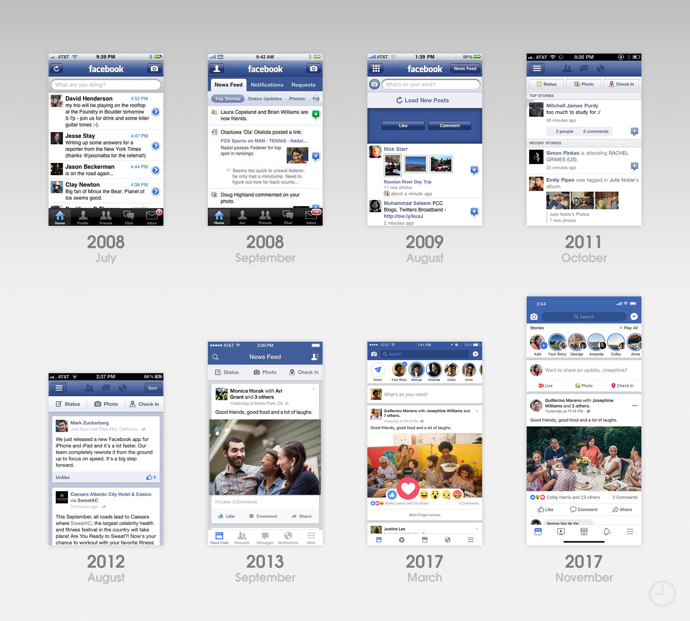

# MFS - паттерн построения UI в iOS приложениях

Логика развития мобильных приложений заключается в постепенном усложнении функциональной нагрузки на пользовательский интерфейс.<br>Что в свою очередь приводит к росту кодовой базы и затруднению ее обслуживания.<br>`MFS` - позволяет создавать современный дизайн приложений и при этом избежать такого явления как `MassiveViewController`.<br><br>

<p align="center">
  
</p>

[Фото: 10 years of the App Store: The design evolution of the earliest apps - 9to5Mac](https://9to5mac.com/2018/07/10/app-store-10-years-design-evolution/)
<br><br>

## Причины создания паттерна

Времена когда весь интерфейс контроллера настраивался целиком в методе `viewDidLoad` давно закончились.<br>Настройка графических компонентов и пользовательского `layout` стала занимать сотни строк кода.<br>Помимо массивной настройки и инициализации, встает второй немало важный вопрос поддержки и управления созданными активами.<br><br>

О существующих трудностях знают в Купертино, на изменение требований рынка компания отреагировала выпуском перспективной технологией `SwiftUI`.<br>Которая к сожалению имеет ряд серьезных ограничений, например поддержка от `iOS 13` и выше.  
Что на данный момент абсолютно неприемлемо для большинства солидных приложений, которые стараются охватить максимально большую аудиторию пользователей.<br><br>`MFS` - же напротив ориентирован на поддержку и разгрузку уже существующих приложений.<br>А набор используемых технологий позволяет внедрять паттерн на самую большую аудиторию приложений.<br>

Архитектурный паттерн `MFS` (`Managment`-`Frames`-`Styles`) был разработан, для того чтобы соответствовать духу времени и его потребностям.<br><br>

## Кому может понадобиться MFS ?

В первую очередь паттерн рекомендуется использовать тем разработчикам, которые занимаются строительством сложных интерфейсов, в особенности если дизайн значительно различается в зависимости от ориентации устройства.<br>

<p align="center">
  
</p>

<br>

Если же ваше приложение имеет крайне простой интерфейс, то возможно более оптимальным будет использование стандартного `Storyboard` и `Autolayout`.<br><br>

## Отношение к Autolayout и другим подобным технологиям

Поскольку исторически паттерн создавался именно для реализации сложных дизайнов, поэтому в стандартной своей реализации `MFS` - имеет ручное вычисление всех `frame`, без использования каких-либо сторонних библиотек.<br>

 Подобный подход позволяет крайне гибко реализовывать любые требования дизайнера, чего к примеру не позволяет делать или же серьезно ограничивает `Autolayout`.<br>
Однако, использование технологии `Autolayout` не запрещено, поскольку паттерн имеет высокую декомпозированность, пользуясь которой, вы можете заменить ручной расчет координат на создание `constraints`.<br>

## Обзор паттерна

Паттерн `MFS` призван равномерно распределить обязанности между категориями класса, с целью избежания возникновения `MassiveViewController`.

<p align="center">
  
</p>

<br><br>

| Название категории | Обязанности                                                                                                                                                                           |
| ------------------ | ------------------------------------------------------------------------------------------------------------------------------------------------------------------------------------- |
| `+Managment`       | Содержит методы дополнительного жизненного цикла интерфейса, которые инициализируют, добавляют на экран, наполняют контентом и совершают прочие действия.<br/>                        |
| `+Frames`          | Содержит методы вычисляющие размеры и координаты `subviews`.                                                                                                                          |
| `+Styles`          | Содержит методы графической конфигурации `subviews`.<br/>Например задает цвет,закругление,шрифт, и т.д.<br/>Как правило, для каждого `property` существует отдельный метод настройки. |

<br>

Как стало вам понятно, категория `+Managment` является главенствующей, она содержит дополнительные методы, которые полностью забирают на себя все хлопоты по созданию и обслуживанию интерфейса контроллера.<br>Остальные же категории содержат так называемые [чистые функции](https://en.wikipedia.org/wiki/Pure_function), которые более широко известны под названием **pure function**.<br><br>

> Функция является "**чистой**" если она мутирует только те значения, которые создала самостоятельно или же приняла из собственных параметров.

<br>То есть, если функция изменяет некие глобальные переменные, которые не были переданы ей в параметры, то "**чистой**" она не является.<br>

Обратите внимание, на то, что методы категории `+Frames` **ВСЕГДА** должны быть чистыми.<br>Методы же категории `+Styles` могут быть чистыми по усмотрению пользователя, поскольку это не так критично.<br><br>На главный файл имплементации контроллера (`ViewController.m`) ложится обязанность выполнять протоколы различных представлений (напр.:`UITableViewDelegate`, `UITableViewDataSource`), а также содержать методы `IBAction`.<br>Выше были перечисленны основные обязанности, но в случае острой необходимости, вы должны самостоятельно принимать решение - размещать некий функционал в файле имплементации или же вынести его в отдельную категорию.<br>Также стоит заметить, что вся бизнес-логика содержится во вьюМодели вашего контроллера или же во вьюМоделях его `subviews`.<br><br>Подобная целенаправленная политика позволяет умещать такие сложные контроллеры, как профиль пользователя и его стену, всего в около **~300** строчек кода на `ObjC` и вероятно еще меньше - на `Swift`.<br>В свою очередь, такая лаконичность полностью исключает побочный эффект в виде "бесконечного скроллинга" и поиска нужного метода.<br>Все методы распределены строго по категориям и если нам, например, потребуется изменить размер шрифта или поменять `layout`, мы с легкостью откроем соответствующий файл и не будем бесконечно скролить основной код контроллера.<br><br>

## Порядок вызова методов построения UI

На схеме ниже показаны методы и порядок их вызовов для построения `UI` в `UIViewController`.<br>Как мы можем увидеть процесс построения `UI` начинается из метода `viewDidAppear`, который вызывает метод `prepareUI`.<br>Который в свою очередь, по цепочке, вызывает все остальные.<br>Также надо сказать, что иногда, при перевороте экрана или же при установке новой вьюМодели, нам требуется вызывать разный набор методов - все зависит от непосредственной сложности вашего интерфейса.<br>На самых простых представлениях, после переворота экрана, нам потребуется вызывать только метод `resizeSubviews`, на более сложных, где нужно, например скрывать некоторые элементы для определенных ориентаций, там может понадобиться и вызов `updateStyles` или же `bindDataFrom`.<br><br>

<p align="center">
  
</p>

<br>

## Обзор контроллера

Подобный обзор паттерна будет проводиться на примере демо приложения.  
Данный контроллер входа в приложение имеет различную верстку для разных ориентаций.<br>В портретной ориентации кнопки находятся друг под другом, а в горизонтальной находятся на одной высоте, с разных сторон экрана.<br>Даже такой минималистичный дизайн является частным случаем труднореализуемого интерфейса с помощью применения стандартного `Autolayout`.


<br>Ниже представлены `.h`/`.m` контроллера.<br>Обратите внимание, что помимо стандартного набор проперти, наш контроллер имеет две достаточно необычных, в привычном понимании, переменных.

```objectivec
@interface LoginController : UIViewController

// ViewModel
@property (nonatomic, strong, nullable) LoginViewModel* viewModel;
@property (nonatomic, strong, nullable) LoginViewModel* oldViewModel;

// UI
@property (nonatomic, strong, nullable) UIImageView* logoImgView;
@property (nonatomic, strong, nullable) UIButton* signInButton;
@property (nonatomic, strong, nullable) UIButton* signUpButton;

@property (nonatomic, strong, nullable) CAGradientLayer *gradient;
@property (nonatomic, assign) CGSize oldSize;

#pragma mark - Actions
- (void) signUpBtnAction:(UIButton*)sender;
- (void) signInBtnAction:(UIButton*)sender;

#pragma mark - Initialization
+ (LoginController*) initWithViewModel:(nullable LoginViewModel*)viewModel;
@end
```

Речь идет о `oldViewModel` и `oldSize`- эти проперти помогают избегать лишних перерисовок и вставок данных.<br>Подробней о них будет рассказано в разборах отдельных категорий.

```objectivec
@interface LoginController ()
@end

@implementation LoginController

#pragma mark - Life cycle

- (void) viewDidAppear:(BOOL)animated
{
    [super viewDidAppear:animated];
    [self prepareUI];
}

- (void)viewWillTransitionToSize:(CGSize)size withTransitionCoordinator:(id<UIViewControllerTransitionCoordinator>)coordinator
{
    __weak LoginController* weak = self;
    [coordinator animateAlongsideTransition:nil completion:^(id<UIViewControllerTransitionCoordinatorContext> context) {
        [UIView animateWithDuration:0.3 delay:0 options:UIViewAnimationOptionCurveEaseOut animations:^{
            [weak resizeSubviews:weak.viewModel];
        } completion:nil];
    }];
}

#pragma mark - Action

- (void) signUpBtnAction:(UIButton*)sender{
    [self.viewModel signUpBtnAction];
}

- (void) signInBtnAction:(UIButton*)sender{
    [self.viewModel signInBtnAction];
}

#pragma mark - Getters/Setters

- (void)setViewModel:(LoginViewModel *)viewModel
{
    _viewModel = viewModel;
      if ((!self.oldViewModel) && (self.view)){
         [self prepareUI];
    } else if ((self.oldViewModel) && (self.view)){
        [self bindDataFrom:viewModel];
        [self resizeSubviews:viewModel];
    }
}

#pragma mark - Initialization

+ (LoginController*) initWithViewModel:(nullable LoginViewModel*)viewModel
{
    LoginController* vc = [[LoginController alloc] init];
    if (vc) {
        vc.viewModel = (viewModel) ? viewModel : [LoginViewModel defaultMockup];
    }
    return vc;
}
@end
```

Просмотрев код расположенный выше, можно сказать, что в результате декомпозиции основной файл контроллера остается крайне лаконичным.<br>

<br>

### Обзор методов категории +Managment

| Имя метода               | Принимает ли вьюМодель | Предназначение                                                                                                                                                                                                                                                        |
| ------------------------ |:----------------------:| --------------------------------------------------------------------------------------------------------------------------------------------------------------------------------------------------------------------------------------------------------------------- |
| `prepareUI`              | ❌                      | Главный метод построения `UI`, вызывает нужную последовательность методов.<br/>Данную функцию рекомендуется вызывать из `viewDidAppear`.                                                                                                                              |
| `removeSubviews`         | ❌                      | Удаляет все `subviews` с `superView`.<br/>А также обнуляет все проперти на `UI` элементы.                                                                                                                                                                             |
| `initSubviews`           | ✅                      | Инициализирует нужные `subviews`.                                                                                                                                                                                                                                     |
| `updateStyles`           | ✅                      | Вызывает индивидуальные методы настройки для каждого `subviews`, куда также передает вьюМодель, на основании данных которой может быть принято решение относительно стилей.<br/>Например, задает разный цвет для плашек сообщений в зависимости от пола пользователя. |
| `bindDataFrom`           | ✅                      | Вставляет данные из вьюМодели в `subviews`.                                                                                                                                                                                                                           |
| `resizeSubviews`         | ✅                      | Вызывает индивидуальные методы расчета размеров и координат для каждой `subviews`.                                                                                                                                                                                    |
| `addSubviewsToSuperView` | ❌                      | Добавляет `subviews` на `superView` если те были проинициализированы и не добавлены на родительское представление ранее.                                                                                                                                              |

| `postUIsetting`          | ❌                      | Здесь должна происходить настройка `subviews` для которых не было создано уникальных методов конфигурации по причине их ненадобности.
<br/>Например, тут будет настраиваться `statusBar`,`gestures`,`allowSelectation` и тд.                                          |

Из выше перечисленных методов явно прослеживается виденье того, как должен строиться `UI` в приложении:

1. Удаление всех `subviews` и обнуление всех проперти на `UI` элементы.
   (Если того требует ситуация).

2. Инициализация нужных `subviews`.

3. Обновление стилей `subviews` (цвет/размер шрифта итд).

4. Вставка данных в `subviews`.

5. Расчет и установка корректных `frames` для `subviews`.

6. Добавление полностью готовых `subviews` на родительское представление.

<br>

### Реализация методов категории +Managment

Для того чтобы внутри `viewDidAppear` не вызывать целый набор методов, был придуман метод-обертка `prepareUI`, `который` вызывает методы категории в нужной последовательности.<br><br>Обратите внимание, на методы `resizeSubviews` и `bindDataFrom`, порядок их вызовов в некоторых ситуациях может быть прямо противоположенный.<br><br>Например, некоторые библиотеки, кэширующие изображения из интернета, возвращают картинку не в полном разрешении, а уже заранее подготовленную под размер вашего `UIImageView`, тогда, если вы сначала попытаетесь вставить картинку в рамку размером `0x0`, у вас может произойти ошибка.<br><br>В классическом сценарии сначала `subviews` наполняются данными, а потом производится расчет размеров и координат.

```objectivec
/*--------------------------------------------------------------------------------------------------------------
   Основной метод построения интерфейса. Вызывает нужную последовательность методов
 --------------------------------------------------------------------------------------------------------------*/
- (void) prepareUI
{
    if (self.view){
        [self removeSubviews];
        [self initSubviews:self.viewModel];
        [self updateStyles:self.viewModel];
        [self bindDataFrom:self.viewModel];
        [self resizeSubviews:self.viewModel];
        [self addSubviewsToSuperView];
        [self postUIsetting];
    }
}
```

<br>Метод удаления всех `subviews` с родительского представления.<br>При работе с контроллером нужен - только в исключительных случаях.<br><br>Например, если данные во viewModel могут динамически меняться и набор с расположением `subviews` зависит от вариативности `viewModel`, то есть для одной вьюМодели у вас будет один набор `subviews`, в определенном месте, а для вьюМодел с другим набором данных, будут иные subviews с прочими `UI` эффектами.<br>
Тогда при смене `viewModel` имеет смысл вызывать не `bindDataFrom` и `resizeSubviews`, а полноценный метод `prepareUI`, потому что он вызовет всю цепочку, которая прежде всего удалит все старые представления.

```objectivec
/*--------------------------------------------------------------------------------------------------------------
 Удаляем все `subviews` и обнуляем все проперти на UI элементы.
 --------------------------------------------------------------------------------------------------------------*/
- (void) removeSubviews
{
    // removing subviews from superview
    for (UIView* subview in self.view.subviews){
        [subview removeFromSuperview];
    }
    // remove sublayers from superlayer
    for (CALayer* sublayer in self.view.layer.sublayers) {
        [sublayer removeFromSuperlayer];
    }

    self.logoImgView   = nil;
    self.signInButton  = nil;
    self.signUpButton  = nil;
    self.gradient      = nil;
}
```

Обратите внимание, что в этом методе происходит чистая инициализация, без каких-либо настроек.

```objectivec
/*--------------------------------------------------------------------------------------------------------------
  Инициализирует нужные subviews на основе данных из viewModel
 --------------------------------------------------------------------------------------------------------------*/
- (void) initSubviews:(LoginViewModel*)viewModel
{
    if (self.view)
    {
        if (!self.logoImgView)  self.logoImgView  = [[UIImageView alloc] init];
        if (!self.signInButton) self.signInButton = [UIButton buttonWithType:UIButtonTypeCustom];
        if (!self.signUpButton) self.signUpButton = [UIButton buttonWithType:UIButtonTypeCustom];
    }
}
```

Метод `updateStyles` вызывает индивидуальные методы для каждого из `subviews`, с целью настроить их внешний вид.

```objectivec
/*--------------------------------------------------------------------------------------------------------------
  Задает стили для subviews. Цвета/размера шрифта/селекторы для кнопок
 --------------------------------------------------------------------------------------------------------------*/
- (void) updateStyles:(LoginViewModel*)viewModel
{
    if (!viewModel) return;

    if (self.logoImgView)  [self styleFor_logoImgView:self.logoImgView   vm:viewModel];
    if (self.signInButton) [self styleFor_signInButton:self.signInButton vm:viewModel];
    if (self.signUpButton) [self styleFor_signUpButton:self.signUpButton vm:viewModel];
}
```

Во время декларации `.h` файла контроллера, фигурировало проперти `oldViewModel`.<br>В данном случае оно понадобилось нам для осуществления проверки на идентичность моделей.<br>Если вьюМодели идентичны, то биндинга данных не произойдет.<br>

Традиционно подобная конструкция чаще используется при работе с ячейками, но в некоторых случаях может потребоваться и при работе с контроллером.

```objectivec
/*--------------------------------------------------------------------------------------------------------------
 Связывает данные из вьюМодели в subviews
 --------------------------------------------------------------------------------------------------------------*/
- (void) bindDataFrom:(LoginViewModel*)viewModel
{
    // Если модели идентичны, то биндинга данных не происходит
    if (([self.oldViewModel isEqualToModel:viewModel]) || (!viewModel)){
        return;
    }

    [self.logoImgView setImage:[UIImage imageNamed:viewModel.imageName]];
    [self.signInButton setTitle:viewModel.signInBtnTitle forState:UIControlStateNormal];
    [self.signUpButton setTitle:viewModel.signUpBtnTitle forState:UIControlStateNormal];

    self.oldViewModel = viewModel;
}
```

Метод `isEqualToModel` в каждом отдельном случае имеет разную реализацию. <br>Например, может возникнуть ситуация, когда в ваш контроллер устанавливается новая вьюМодель, но основные данные, критически важные данные не отличаются, а были изменены только второстепенные проперти, которые не отображаются в вашем `UI`.<br>Тогда метод `isEqualToModel` должен вернуть значение `NO`, чтобы избежать повторного биндинга данных.<br><br>

В нашем случае он имеет подобную реализацию:

```objectivec
/*--------------------------------------------------------------------------------------------------------------
 Сравнивает модели данных на индетичность.
 --------------------------------------------------------------------------------------------------------------*/
- (BOOL) isEqualToModel:(LoginViewModel*)object
{
    BOOL isEqual = YES;
    if (![object.imageName isEqualToString:self.imageName]){
        return NO;
    }
    if (![object.signInBtnTitle isEqualToString:self.signInBtnTitle]){
        return NO;
    }
    if (![object.signUpBtnTitle isEqualToString:self.signUpBtnTitle]){
        return NO;
    }
    return isEqual;
}
```

Так же как и в `bindDataFrom`, метод `resizeSubviews` в самом начале имеет условие проверки, которое не позволяет повторно вычислять размеры и координаты для `subviews`, если модель данных или размер родительского представления не был изменен.<br>

```objectivec
/*--------------------------------------------------------------------------------------------------------------
  Вызывает индивидуальные методы расчета размеров и координат для subviews. 
  После изменения ориентации или после первой инициализации.
 --------------------------------------------------------------------------------------------------------------*/
- (void) resizeSubviews:(LoginViewModel*)viewModel
{
    // Выходим если модель данных и размеры одни и те же
    if ((([self.oldViewModel isEqualToModel:self.viewModel]) && (CGSizeEqualToSize(self.oldSize, self.view.frame.size))) || (!viewModel)) {
        return;
    }

    if (self.view){
        if (self.logoImgView)  self.logoImgView.frame  = [LoginController rectFor_logoImgView:viewModel  parentFrame:self.view.frame];
        if (self.signInButton) self.signInButton.frame = [LoginController rectFor_signInButton:viewModel parentFrame:self.view.frame];
        if (self.signUpButton) self.signUpButton.frame = [LoginController rectFor_signUpButton:viewModel parentFrame:self.view.frame];
        if (self.gradient)     self.gradient.frame     =  self.view.bounds;
    }
    self.oldSize = self.view.frame.size;
}
```

Добавляем `subviews` на родительское `view`.

```objectivec
/*--------------------------------------------------------------------------------------------------------------
 Добавляет subviews на superView
 --------------------------------------------------------------------------------------------------------------*/
- (void) addSubviewsToSuperView
{
    if (self.view){
        if ((self.logoImgView)  && (!self.logoImgView.superview))   [self.view addSubview:self.logoImgView];
        if ((self.signInButton) && (!self.signInButton.superview))  [self.view addSubview:self.signInButton];
        if ((self.signUpButton) && (!self.signUpButton.superview))  [self.view addSubview:self.signUpButton];
    }
}
```

На этом этапе все методы категории `+Managment` были разобраны и остался единственный метод пост-настройки, который принадлежит категории `+Styles`.

В методе `postUIsetting` мы настраиваем `UI` компоненты, для которых не создали индивидуальных методов.<br>Например, в нем можно добавлять `gestures`, настраивать таблицу, устанавливать цвет статус бара и т.д.

```objectivec
- (void) postUIsetting
{
    UIColor* firstColor  = [UIColor colorWithRed: 0.54 green: 0.36 blue: 0.79 alpha: 1.00];
    UIColor* secondColor = [UIColor colorWithRed: 0.41 green: 0.59 blue: 0.88 alpha: 1.00];;

    self.gradient = [CAGradientLayer layer];
    self.gradient.frame      = self.view.bounds;
    self.gradient.startPoint = CGPointZero;
    self.gradient.endPoint   = CGPointMake(1, 1);
    self.gradient.colors     = [NSArray arrayWithObjects:(id)firstColor.CGColor,(id)secondColor.CGColor, nil];
    [self.view.layer insertSublayer:self.gradient atIndex:0];
}
```

<br><br>

### Реализация методов категории +Styles

В отличии от категории `+Managment`, `+Styles` не имеет системных методов, а лишь содержит индивидуальные методы настройки `UI` компонентов.<br>Ниже будет приведен один из методов.<br>

```objectivec
- (void) styleFor_logoImgView:(UIImageView*)imgView vm:(LoginViewModel*)viewModel
{
    if (!imgView.isStylized){
        imgView.contentMode = UIViewContentModeScaleAspectFit;
        imgView.backgroundColor = [UIColor clearColor];
        imgView.opaque = YES;
        imgView.clipsToBounds       = YES;
        imgView.layer.masksToBounds = YES;
        imgView.alpha = 1.0f;
        imgView.isStylized = YES;
    }
}
```

Обратите внимание на некое проперти `isStylized`, оно было добавлено категорией к каждому наследнику класса `UIView`.<br>

Традиция использовать данную переменную при настройке `UI` элементов пришла от опыта работы с ячейками в таблице.<br>

Создана была для того, чтобы при переиспользовании однотипных ячеек не производилась повторная настройка (уже настроенных элементов), то есть, чтобы еще раз не добавлялись тени, блюры и т.д.

<br><br>

### Реализация методов категории +Frames

Категория `+Frames `также как и `+Styles` не имеет системных методов, но может иметь словари класса, в которых могут быть расположены закэшированные размеры и координаты `subviews`.<br>

Подробный листинг данных методов публиковать не имеет смысла из-за их громоздкости, по сути, там не происходит ничего интересного, стандартное ручное вычисление координат и размеров.<br> 
Но стоит также обратить внимание, что по сравнению с другими категориями, `+Frames` содержит **ИСКЛЮЧИТЕЛЬНО** методы класса (`+`).<br>
Данная традиция также пришла из опыта работы с ячейками, первоначально методы класса были созданы для того, чтобы в фоне можно было заранее вычислить координаты и размеры для всех `subviews` не имея фактического объекта ячейки, а имея только лишь ее вьюМодель.

```objectivec
+ (CGRect) rectFor_signUpButton:(LoginViewModel*)viewModel parentFrame:(CGRect)parentFrame
{
    if (CGRectEqualToRect(CGRectZero, parentFrame)) return CGRectZero;
    // Calculating...
    return rect;
}
```

## Советы и рекомендации

По собственному опыту использования могу сказать, что имплементировать `MFS` можно выборочно.<br>Например, как правило, имеет смысл создавать подобную архитектуру в тех случаях, когда мы имеем сложный `UIViewController` (`UI` для которого ввиду его сложности мы создаем кодом), или же когда имеем сложные ячейки таблицы.  
То есть, для контроллера класса `UITableViewController`, за исключением особых случаев - смысла имплементировать данное решение нет.

## Заключение

В данной статье вы имели возможность ознакомиться с паттерном `MFS` на примере работы с вьюКонтроллерами.<br>Во второй части статьи мы поговорим о применении `MFS` при работе с ячейками таблицы, как обеспечивать **60** `FPS` при быстром скроллинге сложных таблиц на старых девайсах.<br>
